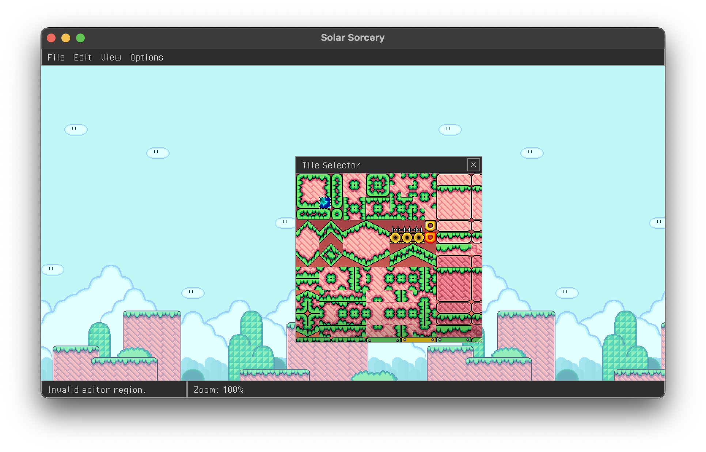

# single file mario
<p align="center"></p>

## About:
I wanted to create a simple Mario game in a single file. Here's the work in progress of that! The idea is to attempt to improve on my organization / heirarchy skills.

## Dependencies
Although the only application specific code is within one file (src/main.c), single file mario does rely on several external dependencies.

- [raylib for window/graphics/input/audio](https://github.com/raysan5/raylib)

- [raygui for immediate mode ui elements](https://github.com/raysan5/raygui)

- [stb_rect_pack for sprite atlas packing](https://github.com/nothings/stb/blob/master/stb_rect_pack.h)

## Cloning and Building:
```sh
git clone --recursive https://github.com/SamEads/single_file_mario && cd single_file_mario # (recursive clone is necessary for the stb submodule)
mkdir build && cd build
cmake ..
cmake --build .
```

## Running:
Just run this command from a directory that has the assets folder present:
```sh
./single_file_mario
```

## Rebuilding:
Assuming you'll be rebuilding from the top of the repo, you just need to run this after making changes:
```sh
cmake --build build # (you can tack on -j <core_count> to the end to utilize multiple cores)
```

## Sprite .dat files:
The sprite .dat files that accompany .pngs are used to define the frames and order of sprite animations. A file can contain the following lines:

* frames:<frame_num> - number of frames in the sprite animation

* order:<n,n,n,n> - the order in which the frames should be displayed

example file:
```
frames:3
order:0,1,2,0
```

Frames are read in vertically. If the frame count is not supplied in a .dat file, a sprite will auto-splice the image, using the image width as the frame height. If no order is supplied, the animation order will be 0,1,2,3,etc for each frame in a sprite.